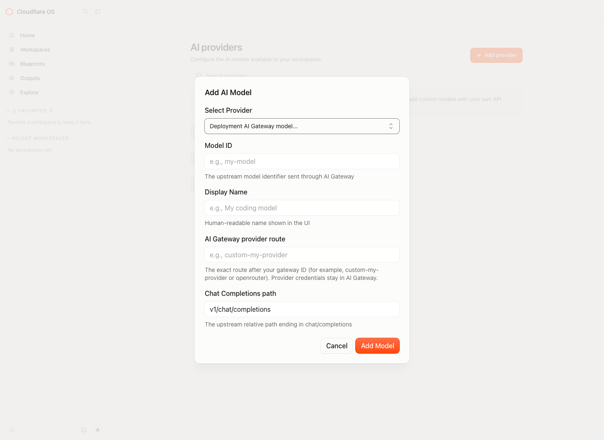

# Cloudflare OS overlay

This repository is a reviewable overlay for a pinned upstream [Cloudflare OS](https://github.com/cloudflare/cloudflare-os) revision. It deliberately contains patches and release metadata, not a modified copy of upstream source or deployment credentials.

## Current release candidate

- Upstream: [`d0cffe48914adff8b296f596137a8809bde89568`](UPSTREAM.json)
- Local delta: four ordered patches in [`patches/`](patches/)
- Integrity manifest: [`PATCHES.sha256`](PATCHES.sha256)

## Deployment AI Gateway model dialog

Patch `0005` puts deployment-managed AI Gateway model setup in the existing **Add AI Model** dialog. A deployment administrator opens **AI providers** → **Add provider**, selects **Deployment AI Gateway model**, and supplies the upstream model ID, display name, provider route, and relative Chat Completions path. The provider credentials remain configured only in Cloudflare AI Gateway.



The screenshot is a local demo using non-secret placeholder Gateway values; it does not call an AI provider. The dialog is shown only to administrators when deployment AI Gateway mode is configured. Ordinary users can select published models but cannot create, edit, or remove them.

`0005` is **not** standalone: it is the UI layer of the ordered patch series. Apply all patches in `patches/`; patches `0001` and `0002` provide the persisted catalog, authorization, model resolution, and AI Gateway routing. To use custom providers, configure the provider and its key in Cloudflare AI Gateway and set the deployment's required `CF_AI_GATEWAY`, `CF_AI_GATEWAY_ACCOUNT_ID`, and `CF_AI_GATEWAY_API_TOKEN` environment variables. No credentials are included in this overlay.

## Independently reproduce the source tree

No trust in this repository's Git history is required. Clone upstream directly, verify this overlay's published checksum/signature, then apply the readable patches:

```sh
# Start in a verified overlay release directory.
overlay_dir=$(pwd)

# Clone the pinned upstream source separately.
git clone https://github.com/cloudflare/cloudflare-os.git cloudflare-os
cd cloudflare-os
git checkout d0cffe48914adff8b296f596137a8809bde89568

# Verify and apply the overlay using paths relative to its release directory.
( cd "$overlay_dir" && sha256sum -c PATCHES.sha256 )
git am --3way "$overlay_dir"/patches/*.patch
```

The result is the candidate source tree. Configure secrets in your own account; this overlay never contains credentials or deployment state.

## Run locally

Run the reconstructed candidate source tree, **not** the pristine `cloudflare-os` submodule. The local stack uses Wrangler and workerd; it does not deploy anything to a Cloudflare account.

Prerequisites:

- Node.js 22 or newer
- [pnpm](https://pnpm.io/) 11.17.0 (the version pinned by the workspace)

From the patched candidate directory:

```sh
pnpm install --frozen-lockfile
pnpm run-local
```

Open [http://localhost:8787](http://localhost:8787). Register with the username `admin` to access the local admin features. Stop the server with <kbd>Ctrl</kbd>+<kbd>C</kbd>. Wrangler persists local state in the candidate's `.wrangler/` directory; remove that directory to reset the instance.

No credentials are needed to start and explore the UI. AI inference and OAuth-backed connectors require your own credentials in a gitignored `.dev.vars` file in the candidate root. Do not commit that file. See the upstream [external-service configuration](https://github.com/cloudflare/cloudflare-os#configuring-external-services) instructions and each relevant `packages/gatekeeper-*/README.md` before adding connector credentials.

For a development loop with a Vite frontend instead of the production-style local bundle, use two terminals:

```sh
# Terminal 1
pnpm dev-server

# Terminal 2
pnpm dev-client
```

Then open [http://localhost:3000](http://localhost:3000). To run the candidate's test suite:

```sh
pnpm test
```

## Local maintainer workflow

The `cloudflare-os` submodule is an unmodified source pin. Initialize it before verifying, do not edit it in place, and use `scripts/apply-patches.sh` on a separate clean clone/worktree to produce a build candidate.

```sh
git submodule update --init --recursive
./scripts/verify-release.sh
./scripts/apply-patches.sh /path/to/clean/cloudflare-os
```

Read `.agents/skills/cloudflare-os-overlay-release/SKILL.md` before changing the pin or patch series.

## Packaging a release

A release archive must include only `UPSTREAM.json`, `patches/`, `PATCHES.sha256`, `RELEASES.md`, this README, and `docs/ai-gateway-model-dialog.png`. Publish a SHA-256 checksum and a detached signature from a documented public key. Do not include the upstream submodule, dependencies, `.dev.vars`, secrets, or local build output.
